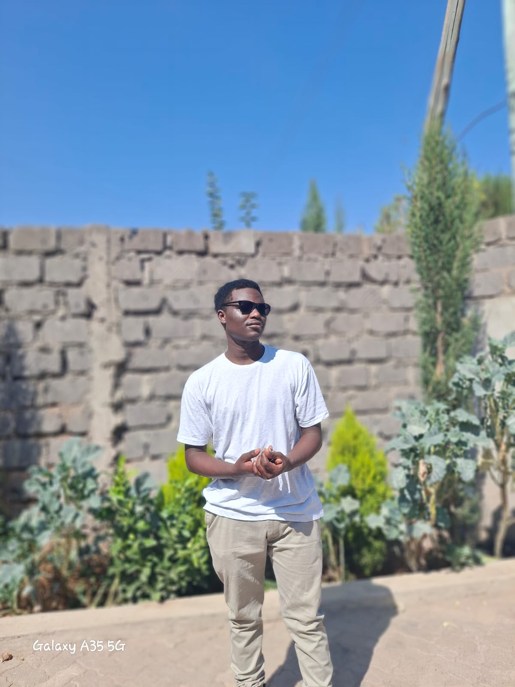

<section id="about" style="padding: 80px 10%; background-color: #111; color: white;">
    <h2 style="text-align: center; font-size: 36px; font-weight: 600; margin-bottom: 40px;">About Me</h2>
    

        

            
        

        

            <h3 style="font-size: 28px; font-weight: 500; margin-bottom: 20px;">Hello, I'm Okemwa Brian!</h3>
            

                I'm a passionate web developer with a focus on creating dynamic and responsive websites. 
                With a deep understanding of both frontend and backend technologies, I strive to build seamless 
                user experiences and clean, maintainable code. I am always learning and experimenting with new tools 
                and technologies to stay ahead in the rapidly evolving web development landscape.
            

            

                I specialize in <strong>HTML, CSS, JavaScript</strong>, and frameworks like <strong>React</strong> and 
                <strong>Node.js</strong>. Whether it's building an intuitive user interface, integrating an API, or working 
                on the server-side, I have the skills to handle it all.
            

            

                When I'm not coding, you can find me exploring new tech trends, contributing to open-source projects, 
                or experimenting with design tools like Figma and Adobe XD.
            

        

    

</section>
